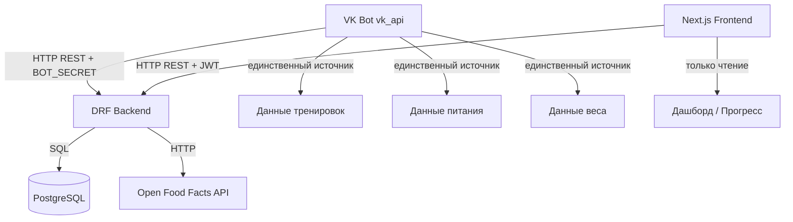
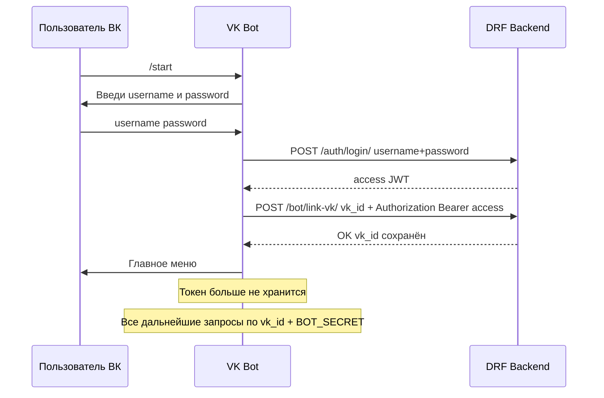
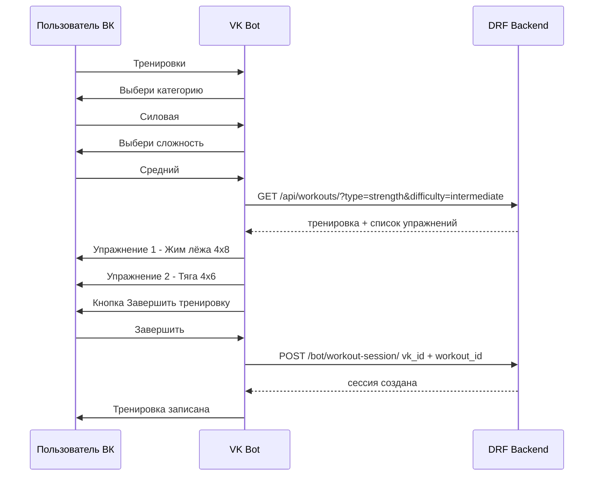

# FitProgress — план разработки

## Концепция системы

Три независимых приложения с чёткими ролями:

| Приложение | Роль |
|---|---|
| **Next.js Frontend** | Витрина — только чтение данных, авторизация |
| **DRF Backend** | Хранение и обработка всех данных |
| **VK Bot** | Единственный источник входных данных (тренировки, питание, вес) |

---

## Архитектура взаимодействия



---

## Поток авторизации через бота



---

## Поток записи тренировки



---

## Поток записи питания

```mermaid
sequenceDiagram
    participant U as Пользователь ВК
    participant B as VK Bot
    participant API as DRF Backend
    participant OFF as Open Food Facts

    U->>B: Питание
    B->>U: Напиши что съел и сколько граммов
    U->>B: гречка 200г
    B->>API: POST /bot/food-entry/ vk_id + text=гречка + grams=200
    API->>OFF: GET search?search_terms=гречка
    OFF-->>API: ккал/белки/жиры/углеводы на 100г
    API-->>B: записано 200 ккал 5г белка...
    B->>U: Записано: гречка 200г — 200 ккал
```

---

## Изменения в моделях

### User — добавить поле
```python
vk_id = models.BigIntegerField(null=True, blank=True, unique=True)
```

### Workout — добавить поле сложности
```python
DIFFICULTY_CHOICES = [
    ('beginner', 'Beginner'),
    ('intermediate', 'Intermediate'),
    ('advanced', 'Advanced'),
]
difficulty = models.CharField(max_length=20, choices=DIFFICULTY_CHOICES, default='beginner')
```

### FoodEntry — убрать FK на Food, добавить поля напрямую
```python
class FoodEntry(models.Model):
    MEAL_TYPES = [
        ('breakfast', 'Breakfast'),
        ('lunch', 'Lunch'),
        ('dinner', 'Dinner'),
        ('snack', 'Snack'),
    ]
    user = models.ForeignKey(User, on_delete=models.CASCADE)
    food_name = models.CharField(max_length=150)      # название из Open Food Facts
    off_product_id = models.CharField(max_length=100, blank=True)  # id/barcode из OFF
    grams = models.FloatField()
    calories = models.FloatField()
    protein = models.FloatField()
    fats = models.FloatField()
    carbs = models.FloatField()
    meal_type = models.CharField(max_length=20, choices=MEAL_TYPES)
    created_at = models.DateTimeField(auto_now_add=True)
```

### Food — удалить модель (данные берём из OFF на лету)

---

## API-эндпоинты

### Публичные (без авторизации)
| Метод | URL | Описание |
|---|---|---|
| POST | `/auth/register/` | Регистрация |
| POST | `/auth/login/` | Логин, получение JWT |

### Для фронтенда (JWT)
| Метод | URL | Описание |
|---|---|---|
| GET/PATCH | `/api/profile/` | Профиль пользователя |
| GET | `/api/workouts/` | Каталог тренировок с упражнениями |
| GET | `/api/workout-sessions/` | История сессий пользователя |
| GET | `/api/food-entries/` | Дневник питания пользователя |
| GET | `/api/measurements/` | Замеры тела пользователя |
| GET/POST | `/api/goals/` | Цели пользователя |

### Для бота (X-Bot-Secret header)
| Метод | URL | Описание |
|---|---|---|
| POST | `/bot/link-vk/` | Привязать vk_id к пользователю по JWT |
| POST | `/bot/workout-session/` | Создать сессию тренировки по vk_id |
| POST | `/bot/food-entry/` | Записать приём пищи по vk_id |
| POST | `/bot/measurement/` | Записать вес по vk_id |

---

## Структура бота

```
bot/
├── main.py              # точка входа, Long Poll loop
├── handlers/
│   ├── auth.py          # /start, логин, привязка vk_id
│   ├── workout.py       # ветка тренировок
│   ├── food.py          # ветка питания
│   └── weight.py        # ветка веса
├── keyboards.py         # все клавиатуры VK
├── api_client.py        # обёртка над requests к DRF
├── states.py            # FSM-состояния диалога в памяти
├── requirements.txt
└── .env.example
```

FSM-состояния хранятся в словаре `user_states: dict[int, str]` в памяти процесса — достаточно для одного инстанса без Redis.

---

## Что уже есть

| Компонент | Статус |
|---|---|
| Модели (основа) | ✅ есть, нужны правки |
| Auth register/login | ✅ работает |
| Frontend UI страницы и компоненты | ✅ есть, на mock-data |
| Frontend → реальный API | ❌ нужно |
| Bot | ❌ нужно с нуля |
| Bot-эндпоинты на беке | ❌ нужно |
| API-эндпоинты для фронта | ❌ нужно |

---

## Порядок реализации

1. **Backend — модели и миграции** (vk_id, difficulty, новая FoodEntry)
2. **Backend — сериализаторы** (Workout, WorkoutSession, FoodEntry, BodyMeasurement, Goal)
3. **Backend — API-эндпоинты для фронта** (/api/...)
4. **Backend — бот-эндпоинты** (/bot/...)
5. **Bot — структура и авторизация**
6. **Bot — ветки тренировок, питания, веса**
7. **Frontend — подключение реального API**
8. **Frontend — логин, онбординг с отправкой на бек**
9. **Frontend — все страницы на реальных данных**
